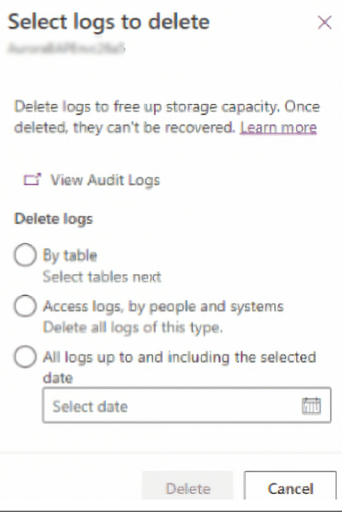
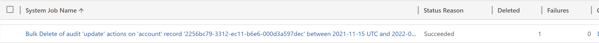

# Dataverse Advanced Audit Log Deletion with BulkDelete API

## Flexible Audit Data Management

[Flexible audit data management](https://powerapps.microsoft.com/en-us/blog/announcing-new-dataverse-auditing-features/) was introduced recently and has benefits over the previous method. There is no longer a requirement to delete entire partitions from oldest to newest. The feature in Power Platform Admin Center allows the flexibility of deleting Audit history for a Table, Access Related or all audit history up to a specified data.



## Limitations

Although, the [new capabilities](https://docs.microsoft.com/en-us/power-platform/admin/free-storage-space#method-10-delete-audit-logs---new-process) are exciting there are scenarios that currently not possible in the UI.

### Example Advanced Audit Deletion Scenarios

- Deleting audit record for single table up to a specified date.
  - The UI allows deletion of the Audit data for a Table but not in conjunction with a date parameter. So you are not be able to delete all Audit data for the Account table before the date 2021-09-11
- Deleting audit records between two dates while maintaining other records
  - When specifying a date the UI only allows deletion of all Audit data up to a date. You cannot specify a start and end date or a single Table. So you would not be able to delete all Account Audit data between 2021-11-15 and 2021-11-17.
- Deleting audit records between two dates, for a single auditing action, on a specific table record
  - The UI doesn't allow specific actions, specific users or specific table records to be provided. *One exception is that you can delete all "Access logs by people and systems")*

## BulkDelete API

**Disclaimer:**
***Any deletion of auditing data is permanent and should be considered very carefully. The providing API calls are samples of how you might remove audit data in some advanced scenarios. These are examples, every attempt was made for them to be correct, but I do not guarantee they are flawless. Also consider most of these scenarios are removing partial data and it may not be the oldest data. This can create a picture of the audit history that isn’t complete. So please consider the risks and proceed with caution when deleting audit data.***

For Advanced Scenarios we can also use the BulkDelete API. Dataverse [documentation](https://docs.microsoft.com/en-us/power-apps/developer/data-platform/retrieve-and-delete-the-history-of-audited-data-changes#delete-audit-data-flexibly-using-bulkdelete) has one basic example. It shows deleting Auditing logs with [“action”](https://docs.microsoft.com/en-us/power-apps/developer/data-platform/reference/entities/audit#BKMK_Action) value of '64'(User Access via Web). This example deletes all entries for the action “User Access via Web”.

The columns in the Audit table are documented [here](https://docs.microsoft.com/en-us/power-apps/developer/data-platform/reference/entities/audit#read-only-columnsattributes), so let’s apply this information to our scenarios using BulkDelete API.

### Executing WebAPI Requests

- A key part of part moving forward is Posting WebAPI Requests to Dataverse
- There are many options for Executing WebAPI Requests for testing. [Postman](https://www.postman.com/) is an excellent tool. If you've never set up an environment in Postman before it helps to follow this article: [Set up a Postman environment (Microsoft Dataverse for Apps) - Power Apps | Microsoft Docs](https://docs.microsoft.com/en-us/power-apps/developer/data-platform/webapi/setup-postman-environment)
- In many cases it's even easier to use a browser extension like [Yet Another REST Client](https://yet-another-rest-client.com/).

Let's dig into some of the example advanced scenarios

### Deleting audit record for single table up to a specified date

 Consider the scenario where you's like to Delete of audit records for 'account' table before 2021-09-11 UTC. The request below is an example of how this can be performed.

- Filter conditions
  - ["objecttypecode"](https://docs.microsoft.com/en-us/power-apps/developer/data-platform/reference/entities/audit#BKMK_ObjectTypeCode) we are specifying "account" as "objecttypecode"
  - ["createdon"](https://docs.microsoft.com/en-us/power-apps/developer/data-platform/reference/entities/audit#BKMK_CreatedOn) we are specifying "createdon" LessThan "2021-09-11T00:00:00Z"

**Request**

 ```http
 POST [Organization URI]/api/data/v9.1/BulkDelete HTTP/1.1  
Accept: application/json  
OData-MaxVersion: 4.0  
OData-Version: 4.0  

{
  "QuerySet":
      [
        {
          "EntityName": "audit",
          "Criteria": {
              "FilterOperator": "And",
              "Conditions": [
                  {
                    "AttributeName": "objecttypecode",
                    "Operator": "Equal",
                    "Values": [ {"Type": "System.String", "Value": "account"} ]
                  },
                  {
                    "AttributeName": "createdon",
                    "Operator": "LessThan",
                    "Values": [ {"Type": "System.DateTime", "Value": "2021-09-11T00:00:00Z"} ]
                  }
              ],
              "Filters": []
          }
        }
      ],
      "JobName": "Bulk Delete of audit records for 'account' table before 2021-09-11 UTC",
      "SendEmailNotification": false,
      "ToRecipients": [],
      "CCRecipients": [],
      "RecurrencePattern": "",
      "StartDateTime": "2022-02-02T10:00:00.000Z"
}
 ```

### Deleting audit records between two dates while maintaining other records

Consider the scenario where you'd like Delete of audit records for 'account' table between 2021-11-15 UTC and 2021-11-17 UTC. The request below is an example of how this can be performed.

- Filter conditions
  - ["objecttypecode"](https://docs.microsoft.com/en-us/power-apps/developer/data-platform/reference/entities/audit#BKMK_ObjectTypeCode) we are specifying "account" as "objecttypecode"
  - ["createdon"](https://docs.microsoft.com/en-us/power-apps/developer/data-platform/reference/entities/audit#BKMK_CreatedOn) we are specifying a couple values
    - "createdon" GreaterThan "2021-11-15T00:00:00Z"
    - "createdon" LessThan "2021-11-17T00:00:00Z"

**Request**

 ```http
 POST [Organization URI]/api/data/v9.1/BulkDelete HTTP/1.1  
Accept: application/json  
OData-MaxVersion: 4.0  
OData-Version: 4.0  

{
  "QuerySet":
      [
        {
          "EntityName": "audit",
          "Criteria": {
              "FilterOperator": "And",
              "Conditions": [
                  {
                    "AttributeName": "objecttypecode",
                    "Operator": "Equal",
                    "Values": [ {"Type": "System.String", "Value": "account"} ]
                  },
                  {
                    "AttributeName": "createdon",
                    "Operator": "LessThan",
                    "Values": [ {"Type": "System.DateTime", "Value": "2021-11-17T00:00:00Z"} ]
                  },
                  {
                    "AttributeName": "createdon",
                    "Operator": "GreaterThan",
                    "Values": [ {"Type": "System.DateTime", "Value": "2021-11-15T00:00:00Z"} ]
                  }
              ],
              "Filters": []
          }
        }
      ],
      "JobName": "Bulk Delete of audit records for 'account' table between 2021-11-15 UTC and 2021-11-17 UTC",
      "SendEmailNotification": false,
      "ToRecipients": [],
      "CCRecipients": [],
      "RecurrencePattern": "",
      "StartDateTime": "2022-02-02T10:00:00.000Z"
}
 ```

### Deleting audit records between two dates, for a single auditing action, on a specific table record

This is an example of Bulk Deleting Audit logs for 'update' actions on 'account' record '2256bc79-3312-ec11-b6e6-000d3a597dec' between 2021-11-15 UTC and 2021-11-17 UTC for user with systemuserid '9f7136be-12ff-eb11-94ef-000d3a3433e9'.

- Filter conditions
  - ["objecttypecode"](https://docs.microsoft.com/en-us/power-apps/developer/data-platform/reference/entities/audit#BKMK_ObjectTypeCode) we are specifying "account" as "objecttypecode"
  - ["createdon"](https://docs.microsoft.com/en-us/power-apps/developer/data-platform/reference/entities/audit#BKMK_CreatedOn) we are specifying a couple values
    - "createdon" GreaterThan "2021-11-15T00:00:00Z"
    - "createdon" LessThan "2021-11-17T00:00:00Z"
  - ["action"](https://docs.microsoft.com/en-us/power-apps/developer/data-platform/reference/entities/audit#BKMK_Action) we are specifying the value of "2". This is the "update" action.
  - ["userid"](https://docs.microsoft.com/en-us/power-apps/developer/data-platform/reference/entities/audit#BKMK_UserId) we are specifying "9f7136be-12ff-eb11-94ef-000d3a3433e9" which is the id of the user making the record changes
  - ["objectid"](https://docs.microsoft.com/en-us/power-apps/developer/data-platform/reference/entities/audit#BKMK_ObjectId) we are specifying "2256bc79-3312-ec11-b6e6-000d3a597dec" which correlates to the Primary Key of the table for the record being audited. In this case it's the "accountid" on [Account Table](https://docs.microsoft.com/en-us/power-apps/developer/data-platform/webapi/reference/account?view=dataverse-latest).

**Request**

 ```http
 POST [Organization URI]/api/data/v9.1/BulkDelete HTTP/1.1  
Accept: application/json  
OData-MaxVersion: 4.0  
OData-Version: 4.0  

{
  "QuerySet":
      [
        {
          "EntityName": "audit",
          "Criteria": {
              "FilterOperator": "And",
              "Conditions": [
                  {
                    "AttributeName": "objecttypecode",
                    "Operator": "Equal",
                    "Values": [ {"Type": "System.String", "Value": "account"} ]
                  },
                  {
                    "AttributeName": "createdon",
                    "Operator": "LessThan",
                    "Values": [ {"Type": "System.DateTime", "Value": "2021-11-17T00:00:00Z"} ]
                  },
                  {
                    "AttributeName": "createdon",
                    "Operator": "GreaterThan",
                    "Values": [ {"Type": "System.DateTime", "Value": "2021-11-15T00:00:00Z"} ]
                  },
                  {
                    "AttributeName": "action",
                    "Operator": "Equal",
                    "Values": [ {"Type": "System.String", "Value": "2"} ]
                  },
                  {
                    "AttributeName": "userid",
                    "Operator": "Equal",
                    "Values": [ {"Type": "System.Guid", "Value": "9f7136be-12ff-eb11-94ef-000d3a3433e9"} ]
                  },
                  {
                    "AttributeName": "objectid",
                    "Operator": "Equal",
                    "Values": [ {"Type": "System.Guid", "Value": "2256bc79-3312-ec11-b6e6-000d3a597dec"} ]
                  }      
              ],
              "Filters": []
          }
        }
      ],
      "JobName": "Bulk Delete of audit 'update' actions on 'account' record '2256bc79-3312-ec11-b6e6-000d3a597dec' between 2021-11-15 UTC and 2021-11-17 UTC for user '9f7136be-12ff-eb11-94ef-000d3a3433e9'",
      "SendEmailNotification": false,
      "ToRecipients": [],
      "CCRecipients": [],
      "RecurrencePattern": "",
      "StartDateTime": "2022-02-02T10:00:00.000Z"
}
 ```

After the execution of a Webapi Request the response will look like this

**Response Example**
```http
{
  "@odata.context": "[Organization URI]/api/data/v9.1/$metadata#Microsoft.Dynamics.CRM.BulkDeleteResponse",
  "JobId": "d96366ae-20d6-ec11-a7b5-000d3a3adb38"
}
```

The bulk delete job can then be found in the Microsoft Power Platform admin center by going to Environments > [select an environment] > Settings > Data management > Bulk deletion.

