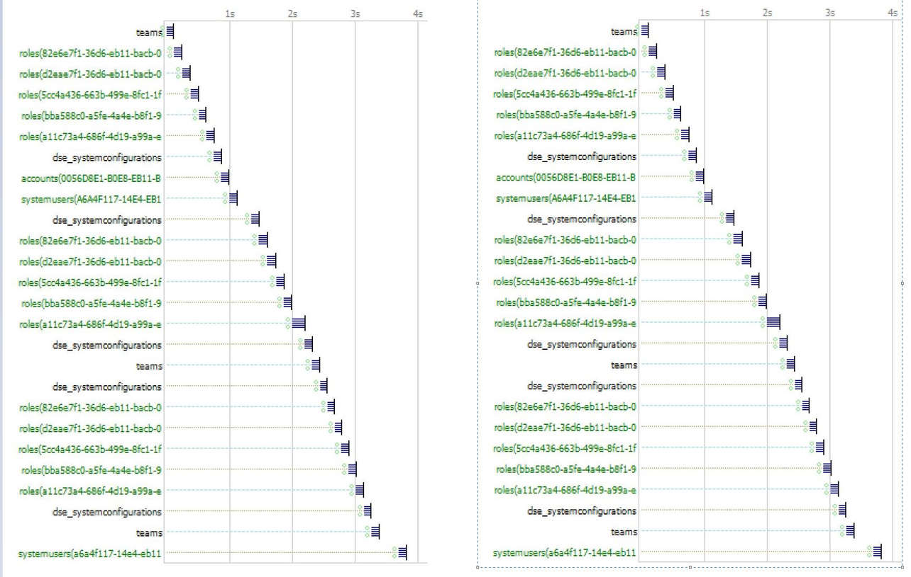
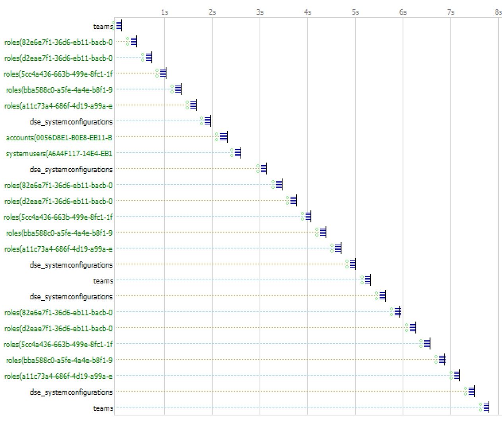
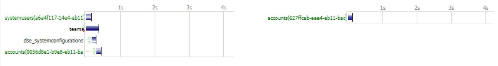

# Get User Team Name from browser cache in Dataverse Model Driven App

## Summary

I have seen customers create various solutions around a “get users teams name” implemented Microsoft Dynamics 365 CE/CRM. At the time I am writing this the most common solution is a synchronous XHR call to the platform to get the data each time a check is a user is on a team. I am going to propose an approach and pattern that will work for most any slowly changing dataset. So, by slowly changing dataset I mean data that is relatively static and at the most changes less then weekly but usually only occasionally within a year. We will demonstrate this with a JavaScript Async Await pattern with some newly introduced functionality added to onload, onsave and ribbon events on D365CE forms and also needs modern browsers that support ES6.
 
## History

A common design pattern in use today is to enable/disable or hide/show client-side form attributes as a part of controlling a business logic form flow. This has been achieved with JavaScript  in several different patterns. The challenge is that quite a few patterns can cause poor client-side performance, especially in high latency environments. 

Here are some example conversations from the Microsoft Dynamics CRM Forum community on the subject:

   [(+) How to retrieve a user's teams? Javascript. - Microsoft Dynamics CRM Forum Community Forum](https://community.dynamics.com/crm/f/microsoft-dynamics-crm-forum/218804/how-to-retrieve-a-user-s-teams-javascript)

While these answers may have been acceptable at the time, there are a couple patterns in the community responses that we want to avoid.

Let’s look at some patterns we want to avoid or replace.

## Anti-patterns

My co-worker, @ddevine@microsoft.com and I have culminated some examples that we have seen from a variety of customers for an internal presentation and demo. 

Again this sample code is an **anti-pattern to avoid**.

Please note [^disclaimer]

```js
var Spark30Common = window.Spark30Common || {};

/**
 * @function Spark30Common.AntiUserIsTeamMember
 * @description Returns true if user is a member of owner team name with the name
 * @teamName String with exact match of Owner Team name in question
 * @return bool
 */
 Spark30Common.AntiUserIsTeamMember = function (teamName) {
    "use strict";
    try{
        
        //initialize return value
        var IsUserExists = false;

        // query for the current users team membership. Filtered to owner teams and the passed in team name
        var teamFetchXml =  "<fetch no-lock='true'>" +
                                "<entity name='team'>" +
                                    "<attribute name='name'/>" +
                                    "<filter>" +
                                        "<condition attribute='teamtype' operator='eq' value='0'/>" +
                                        "<condition attribute='name' operator='eq' value='"+ teamName +"'/>" +
                                    "</filter>" +
                                    "<link-entity name='teammembership' from='teamid' to='teamid' link-type='inner'>" +
                                        "<filter>" +
                                            "<condition attribute='systemuserid' operator='eq-userid'/>" +
                                        "</filter>" +
                                    "</link-entity>" +
                                "</entity>" +
                            "</fetch>"

        //Sync XHR query for Owner Teams 
        var userResponse = Spark30Common.executeSyncRequest("/api/data/v9.1/teams?fetchXml=" + teamFetchXml);
        
        //If a record is returned for the specific owener team query return true
        if(userResponse.value.length>0) {
            IsUserExists = true;
        }

        // returns true is the user is a member of the owner team otherwise false
        return IsUserExists;
    } 
    catch(ex){
        Xrm.Navigation.openAlertDialog({ text: ex });
    }
}

/**
 * @function Spark30Common.executeSyncRequest 
 * @description Makes a Synchronous XHR request to the passed in requestUrl
 * @requestUrl url represent the table data to query I.E "/api/data/v9.1/systemusers?&select=fullname"
 * @return string - JSON parsed response 
 */
 Spark30Common.executeSyncRequest = function (requestUrl) {
    "use strict";

    try{
        //build the XMLHttp request and set header values
        var request = new XMLHttpRequest();
        
        //setting "false" to force Synchronous
        request.open('GET', requestUrl, false);

        request.setRequestHeader("OData-MaxVersion", "4.0");
        request.setRequestHeader("OData-Version", "4.0");
        request.setRequestHeader("Accept", "application/json");
        request.setRequestHeader("Content-Type", "application/json; charset=utf-8");
        request.setRequestHeader("Prefer", "odata.include-annotations=\"*\"");
               
        //send the request for the given requestUrl. 
        request.send(null)

        if (request.status === 200) {
        
            //json parse the response and return
            return JSON.parse(request.responseText);
        }
    }
    catch(ex)
    {
        Xrm.Navigation.openAlertDialog({ text: ex });
    }
}
```
Notice the join to 'team' to add the filter for 'teamtype' because I have seen this query get real ugly when only using 'teammembership' if the user is on a bunch of access teams that are system generated one team for each record. The bottom line here is know your data and test throughly.

Also notice the code for the sync XHR request

        **//build the XMLHttp request and set header values
        var request = new XMLHttpRequest();
        
        //setting "false" to force Synchronous
        request.open('GET', requestUrl, false);**

This code will block the UI while and wait for the response and if there are multiple sync XHR request they will operate in series in which they are called.

Because this call is triggered onload and from the ribbon we will retreive this set of values twice from the platform server on each time the form is loaded.   

Here is what a fiddler trace might look like with a first and second form load



You are seeing a large number sync XHR request and they are happening in series. I this particular example you see two sync calls to 'teams' referencing the code above because there is a event onload and in the one in the ribbon. All the calls take about the same 4s on a first time load (cold Load) as the second and subsiquent loads (warm loads). 

And a fiddler trace with 200ms latency takes the 4s and turns it into 8s and nothing is different but the poor network.



So lets look at some new stratiges to improve this performance on the form load time.

## New pattern

This particular strategy I like to refer to as "minimize the number of calls" and in this example we will look at the new functionality added into the platform async onload and ribbon event handlers. By returning a promise to the onload and ribbon events we will effectively be able to block the UI while the async processes and the calls will process more parallel than sync calls. But the largest savings is going to be we are only making the call one time and using the cached data until the page session ends.

```js
/**
 * @function Spark30Common.UserIsTeamMember
 * @description Returns true if user is a member of owner team name passed in and 
 *              caches the list of user teams names in the browser cache if the list is not already cached to limit repeat calls to the api for future request
 * @teamName String with exact match of Owner Team name in question
 * @return bool
 */
 Spark30Common.UserIsTeamMember = async function (teamName) {
    "use strict";
    try{
        if (typeof (Storage) !== "undefined") {
            var userSettings = Xrm.Utility.getGlobalContext().userSettings;

            // define a unique session storage name
            var sessionStorageId = userSettings.userId + ".teams"

            // if session storage with name does not exist populate it 
            if (!sessionStorage.getItem(sessionStorageId)) {

                // query for all the current users owner teams 
                var teamFetchXml =  "<fetch no-lock='true'>" +
                                        "<entity name='team'>" +
                                            "<attribute name='name'/>" +
                                            "<filter>" +
                                                "<condition attribute='teamtype' operator='eq' value='0'/>" +
                                            "</filter>" +
                                            "<link-entity name='teammembership' from='teamid' to='teamid' link-type='inner'>" +
                                                "<filter>" +
                                                    "<condition attribute='systemuserid' operator='eq-userid'/>" +
                                                "</filter>" +
                                            "</link-entity>" +
                                        "</entity>" +
                                    "</fetch>"
                var apiFetchXml = "?fetchXml=" + teamFetchXml
                
                //Await Async query for Owner Teams 
                var userteams = await Xrm.WebApi.retrieveMultipleRecords("team",apiFetchXml);
                
                //populate cache with owner teams response
                sessionStorage[sessionStorageId] = JSON.stringify(userteams);
            }

            // get configuration values from browser cache
            var storedUserTeams = sessionStorage.getItem(sessionStorageId);

            //initialize return value
            var returnValue = false;

            // check for passed in owner team name
            if (storedUserTeams) {                
                var userTeamResponse = JSON.parse(storedUserTeams);
                
                //return true if user is a member of the owner team passed in
                for (var i = 0; i < userTeamResponse.entities.length; i++) {
                    if (userTeamResponse.entities[i]["name"] === teamName) {
                        returnValue = true;
                        break;
                    };
                };
            }
            
            // return true is the user is a member of the owner team otherwise false
            return returnValue;
        }
    } catch(ex){
        Xrm.Navigation.openAlertDialog({ text: ex });
    }
}

```
Above is a section of our common.js functions in the namespace of "Spark30Common". Notice Xrm.WebApi.retrieveRecord returns a promise that we are going to "await" and we are going to define our function as "async" so our function ("UserIsTeamMember") returns a promise.

To learn more about working with Async Await promise patterns please refer to another performance  blog post on the subject:

   [Get a value from Dynamics 365 CE API with Async Await](https://community.dynamics.com/crm/b/crminthefield/posts/get-a-value-from-dynamics-365-ce-api-with-async-await-484252633)

And here is where we get the biggest bang for our buck, by caching the slowly changing data in the browsers cache we are going to store the data.

        **// if session storage with name does not exist populate it 
        if (!sessionStorage.getItem(sessionStorageId)) {
        ...
        //populate cache with owner teams response
        sessionStorage[sessionStorageId] = JSON.stringify(userteams);**

The next time the form loads it will use the browsers cached data and not call the server at all.

        **// get configuration values from browser cache
        var storedUserTeams = sessionStorage.getItem(sessionStorageId);**

For more information on [sessionStorage](https://developer.mozilla.org/en-US/docs/Web/API/Window/sessionStorage) or [localStorage](https://developer.mozilla.org/en-US/docs/Web/API/Window/localStorage) see the links here or in the Additional Storage section below.  

Now when we look at a fiddler trace with the performance improvements we see one call to 'teams' in the first (cold) load and no calls to 'teams' on the subsequent (warm) loads there after. Please keep in mind that other performance tuning was also applied for other calls as well so we are looking at a result for the 'teams' calls going form 2 calls (the same for both cold and warm load) before the performance enhancements and after the enhancements we go to only one call on the cold load and no calls on warm loads.



## Special Thanks

Many thanks go out to my fellow co-workers without this blog would not be possible. 

- @ddevine@microsoft.com
- @melody.universe@microsoft.com
- @jeparson@microsoft.com

## Additional information

[sessionStorage](https://developer.mozilla.org/en-US/docs/Web/API/Window/sessionStorage)

[localStorage](https://developer.mozilla.org/en-US/docs/Web/API/Window/localStorage)

[Get a value from Dynamics 365 CE API with Async Await](https://community.dynamics.com/crm/b/crminthefield/posts/get-a-value-from-dynamics-365-ce-api-with-async-await-484252633)

[async function](https://developer.mozilla.org/en-US/docs/Web/JavaScript/Reference/Statements/async_function)

[Browser support](https://docs.microsoft.com/en-us/power-apps/developer/model-driven-apps/best-practices/business-logic/interact-http-https-resources-asynchronously#browser-support)

[^1]:[Synchronous request](https://developer.mozilla.org/en-US/docs/Web/API/XMLHttpRequest/Synchronous_and_Asynchronous_Requests#synchronous_request)

[Asynchronous OnLoad event handler support](https://docs.microsoft.com/en-us/powerapps/developer/model-driven-apps/clientapi/reference/events/form-onload#asynchronous-onload-event-handler-support)

[Asynchronous OnSave event handler support](https://docs.microsoft.com/en-us/powerapps/developer/model-driven-apps/clientapi/reference/events/form-onsave#asynchronous-event-handler-support)

[Ribbon Custom Rule](https://docs.microsoft.com/en-us/powerapps/developer/model-driven-apps/define-ribbon-enable-rules#custom-rule)

[code](https://github.com/Ben-Fishin/Dynamics-365-CE-Client-Side-Scripting-Patterns)

Here are a few Microsoft service deliveries that identify sync XHR issues in the findings report (please ask your Microsoft CSAM or check out [Power Platform and Dynamics 365 Service Offerings](https://community.dynamics.com/crm/b/crminthefield/posts/pfe-dynamics-365-service-offerings)):
 - [Dynamics 365 Customer Engagement Assessment](https://community.dynamics.com/cfs-file/__key/communityserver-blogs-components-weblogfiles/00-00-00-17-38/Dynamics-365-Customer-Engagement-Assessment-_2D00_-Datasheet.pdf)
 - [Dynamics 365 Customer Engagement: Code Review](https://community.dynamics.com/cfs-file/__key/communityserver-blogs-components-weblogfiles/00-00-00-17-38/Dynamics-365-Customer-Engagement-Code-Review.pdf)
 - [Dynamics 365 Customer Engagement: Performance Review](https://community.dynamics.com/cfs-file/__key/communityserver-blogs-components-weblogfiles/00-00-00-17-38/Datasheet_2D00_Dynamics365PerformanceReview.pdf)


[^disclaimer]:
```js
/*
 * This Sample Code is provided for the purpose of illustration only and is not intended to be used in a production environment.
 * THIS SAMPLE CODE AND ANY RELATED INFORMATION ARE PROVIDED "AS IS" WITHOUT WARRANTY OF ANY KIND, EITHER EXPRESSED OR IMPLIED,
 * INCLUDING BUT NOT LIMITED TO THE IMPLIED WARRANTIES OF MERCHANTABILITY AND/OR FITNESS FOR A PARTICULAR PURPOSE.  We grant You
 * a nonexclusive, royalty-free right to use and modify the Sample Code and to reproduce and distribute the object code form of
 * the Sample Code, provided that You agree: (i) to not use Our name, logo, or trademarks to market Your software product in which
 * the Sample Code is embedded; (ii) to include a valid copyright notice on Your software product in which the Sample Code is
 * embedded; and (iii) to indemnify, hold harmless, and defend Us and Our suppliers from and against any claims or lawsuits,
 * including attorneys? fees, that arise or result from the use or distribution of the Sample Code.
 *
 * Please note: None of the conditions outlined in the disclaimer above will supersede the terms and conditions contained within
 * the Premier Customer Services Description.
 *
 * Extended from CRM SDK References:
 */
```