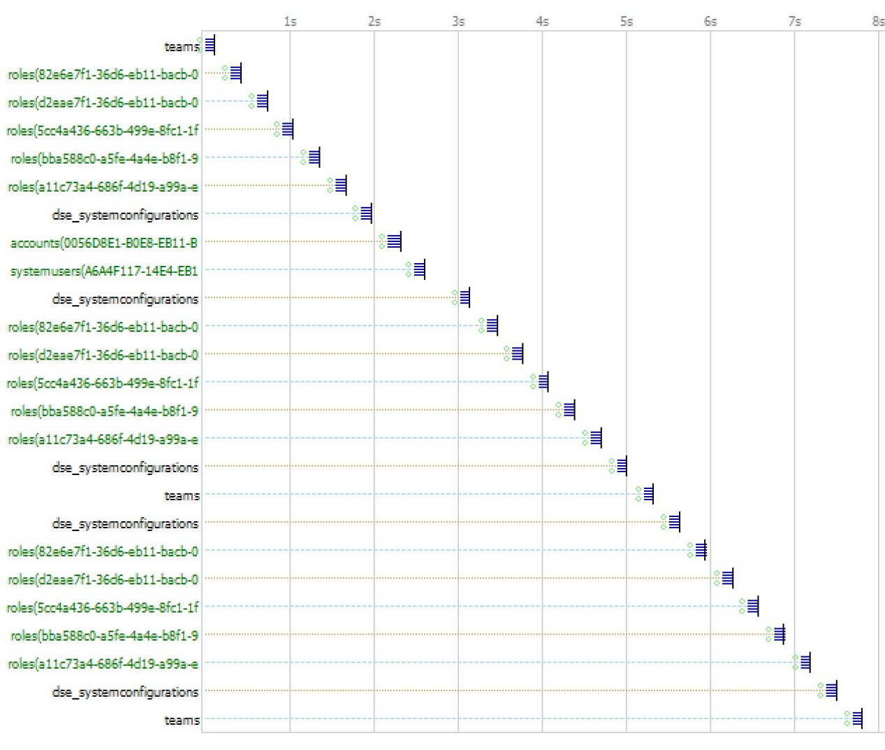
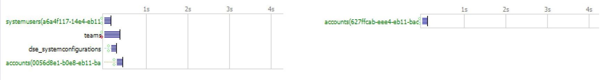

# Get a value from Dynamics 365 CE API with Async Await

## Summary

As a Customer Engineer with Microsoft, I have seen many ways in which Customers and ISVs are being alerted to the fact that they have potential performance issues caused by synchronous (sync) XMLHttpRequest (XHR) in their Dynamics 365 CE (D365CE) custom JavaScript code. The goal here is to demonstrate an asynchronous (async) code pattern to replace these sync XHR calls. That will still have the UI wait on the response and provide better client-side performance. 

Through this blog we will demonstrate a solution using modern browsers that support ES6 and a JavaScript pattern using Async Await keywords. This includes some new platform functionality that has been added to [onload](https://docs.microsoft.com/en-us/powerapps/developer/model-driven-apps/clientapi/reference/events/form-onload#asynchronous-onload-event-handler-support), [onsave](https://docs.microsoft.com/en-us/powerapps/developer/model-driven-apps/clientapi/reference/events/form-onsave#asynchronous-event-handler-support) and [ribbon](https://docs.microsoft.com/en-us/powerapps/developer/model-driven-apps/define-ribbon-enable-rules#custom-rule) events on D365CE form events.
 
## History

 There are a several reasons sync XHR calls are being highlighted for replacement with async calls.
 1. Modern browsers have deprecated the use of sync XHR calls[^1]. 
 2. Sync XHR calls have a significant potential to cause performance issues.
 3. Sync XHR calls are especially problematic for users in high latency or poor network environments and are not typically discovered by developers because they are not testing in such conditions.

 Let’s look at some patterns we want to avoid or replace.

 ## Anti-patterns
 
Here are some community examples of the patterns that we want to avoid or replace. Some are based on common practices at the time.  
 
- [Dynamics CRM 2013/2015/2016/Dynamics 365](https://crm365blog.wordpress.com/2018/08/07/part-1-code-conversion-to-latest-web-api-dynamics-365/)
- [Dynamics 365 Web API: Query data with examples (Javascript)](https://functionalthoughts.com/dynamics-365-web-api-retrieve-data-javascript/)
- [Synchronous and asynchronous XMLHttpRequest in Javascript from Microsoft Dynamics CRM perspective](http://piyushnandanwar.blogspot.com/2017/12/sync-and-async-xmlhttprequest-in.html)
 
 My co-worker, [Darrin](https://github.com/ddevine-msft) and I have generated some examples that we have seen from a variety of customers for an internal presentation and demo at Microsoft. **Again this sample code is an anti-pattern to avoid.**

 *Please note the code disclaimer[^disclaimer]*

```js
var Spark30Common = window.Spark30Common || {};

/**
 * @function Spark30Common.AntiIsCreditHoldAccount
 * @description "Credit Hold"
 * @accountId String with the accountid of the Account Record to retrieve
 * @return bool
 */
 Spark30Common.AntiIsCreditHoldAccount = function (accountId) {
    "use strict";

    //Sync XHR call to retrieve account for the passed in accountId
    var accountResponse = Spark30Common.executeSyncRequest(
        "/api/data/v9.1/accounts("+ accountId.slice(1,-1) +")?$select=creditonhold");

    //initialize return value
    var returnValue = false;

    // check respone has a value 
    if(accountResponse)
    {
        //return true if the account is on credit hold
        if (accountResponse["creditonhold"] === true) {
            returnValue = true;
        };
    }
    return returnValue;
}

/**
 * @function Spark30Common.executeSyncRequest 
 * @description Makes a Synchronous XHR request to the passed in requestUrl
 * @requestUrl url represent the table data to query I.E "/api/data/v9.1/systemusers?&select=fullname"
 * @return string - JSON parsed response 
 */
 Spark30Common.executeSyncRequest = function (requestUrl) {
    "use strict";

    try{
        //build the XMLHttp request and set header values
        var request = new XMLHttpRequest();
        
        //setting "false" to force Synchronous
        request.open('GET', requestUrl, false);

        request.setRequestHeader("OData-MaxVersion", "4.0");
        request.setRequestHeader("OData-Version", "4.0");
        request.setRequestHeader("Accept", "application/json");
        request.setRequestHeader("Content-Type", "application/json; charset=utf-8");
        request.setRequestHeader("Prefer", "odata.include-annotations=\"*\"");
               
        //send the request for the given requestUrl. 
        request.send(null)

        if (request.status === 200) {
        
            //json parse the response and return
            return JSON.parse(request.responseText);
        }
    }
    catch(ex)
    {
        Xrm.Navigation.openAlertDialog({ text: ex });
    }
}
```
Notice the code for the sync XHR request.

        //build the XMLHttp request and set header values
        var request = new XMLHttpRequest();
        
        //setting "false" to force Synchronous
        request.open('GET', requestUrl, false);

This code will block the User Interface (UI) and wait for the response and if there are multiple sync XHR request they will operate in the series in which they are called.

Here is what a [Fiddler](https://www.telerik.com/fiddler) trace might look like with a first and second form load. The *accounts()* call is the one we are examining.


Above you are seeing a large number sync XHR request and they are happening in series one after another. It takes about the same 4s of time on a first time load (cold Load) as the second and subsiquent loads (warm loads). 

Introducing a network with 200ms latency increases the 4 second load to 8 seconds.



So lets look at some new strategies to improve this performance on the form load time.

## New pattern

This particular strategey I like to refer to as *"if you have to make the call make it async"* and in this example we will look at the new functionality added into the platform async onload handler. Please note there is an additional configuration step required to enable Async onload handler as described in the [Asynchronous OnLoad event handler support](https://docs.microsoft.com/en-us/powerapps/developer/model-driven-apps/clientapi/reference/events/form-onload#asynchronous-onload-event-handler-support) official documentation. By returning a promise to the onload event we will effectivly be able to hold the UI while the async calls will process in a more parallel fasion than sync calls. 

Below is a section of our common.js functions in the namespace of `Spark30Common`. Notice `Xrm.WebApi.retrieveRecord` returns a promise that we are going to `await` and we are going to define our function as `async` so our function (`Spark30Common.IsCreditHoldAccount`) returns a promise.

*Please note the code disclaimer[^disclaimer]*

```js
var Spark30Common = window.Spark30Common || {};

/**
 * @function Spark30Common.IsCreditHoldAccount
 * @description Returns true if passed in accountid record “Credit Hold” (creditonhold) value is true
 * @accountId String with the accountid of the Account Record to retrieve
 * @return bool
 */
 Spark30Common.IsCreditHoldAccount = async function (accountId) {
    "use strict";

    //Await Async call to retrieve account for the passed in accountId
    let accountResponse = await Xrm.WebApi.retrieveRecord("account", accountId, "?$select=creditonhold");
    
    //initialize return value
    var returnValue = false;

    // check respone has a value 
    if (accountResponse) {

        //return true if the account is on credit hold
        if (accountResponse["creditonhold"] === true) {
            returnValue = true;
        };
    }

    // return 
    return returnValue;
}
```

Below is a section of our form specific javascript with `NewPatternForm.OnLoad` registered in the onload event of our custom entity form. This code has additional promises being evaluated and we are just going to focus on `NewPatternForm.CheckCreditHold` function. It is returning a promise that we are getting from `Spark30Common.IsCreditHoldAccount` above as well as an additional function. Note the [complete code](https://github.com/Ben-Fishin/Dynamics-365-CE-Client-Side-Scripting-Patterns) can be found in a link in the additional section below. The two promises are being awaited in a `Promise.all` that is returned by `NewPatternForm.CheckCreditHold` then we find this promise being awaited with another `Promise.all` in a `NewPatternForm.OnLoad` that is the single promise being returned to platform async onload handler.

*Please note the code disclaimer[^disclaimer]*

```js
var NewPatternForm = window.NewPatternForm || {};

/**
 * @function NewPatternForm.OnLoad
 * @description Configured in form properties to trigger on form load
 */
NewPatternForm.OnLoad = async function (executionContext) {
    "use strict"
    var formContext = executionContext.getFormContext(); 

    //get the account lookup control from the formcontext 
    var accountControl = formContext.getControl("dse_account");

    //makes a non-UCI blocking block call to show "Auditor" Section based on some evaluation of values
    NewPatternForm.CheckIsAuditor(formContext);
    
    //Returns a Promise. determine if the current user is a member of the "Spark" owner team. Caches value in sessionStorage after first retrieval. Cache is used on subsequent calls
    var checkTeamMemberPromise = NewPatternForm.CheckTeamMember(accountControl);
    
    //Returns a Promise. Function checks "checkAccountCreditHold" config value and retrieves the related account "creditonhold". If account on credit hold a notification is displayed on the form
    var checkCreditHoldPromise = NewPatternForm.CheckCreditHold(formContext);

    //Resolve both promises in parallel. Then return out of onload
    return Promise.all([checkTeamMemberPromise, checkCreditHoldPromise]);
}

/**
 * @function NewPatternForm.CheckCreditHold
 * @description checks "checkAccountCreditHold" config value and retrieves the related account "creditonhold". If on credit hold a notification is displayed on the form
 */
NewPatternForm.CheckCreditHold = async function (formContext) {
    "use strict";

    //get the "Account" lookup attribute value from the formContext
    var accountValue = formContext.getAttribute("dse_account").getValue()
    if (accountValue !== null) {

        //Returns Promise - determine if we should retrieve the Related Accounts "Credit Hold" value
        var checkAccountCreditHoldPromise = Spark30Common.GetConfigurationValue("checkAccountCreditHold");
        
        //Returns Promise - retrieve the Related Account "Credit Hold" value
        var isAccountCreditHoldPromise = Spark30Common.IsCreditHoldAccount(accountValue[0].id);

        //Resolve both promises in parallel.
        const [checkAccountCreditHold, isAccountCreditHold] = await Promise.all([checkAccountCreditHoldPromise, isAccountCreditHoldPromise]);

        //display a form notification if the Related Accounts is on credit hold
        if (checkAccountCreditHold === "1") {
            if(isAccountCreditHold === true) {
                formContext.ui.setFormNotification("Related Account is on credit hold!", "WARNING", "accountCreditHoldNotification");
            } else {
                formContext.ui.clearFormNotification("accountCreditHoldNotification");
            }
        }
    }
}
```

Here is a trace of the first and second form load after all the code performance changes were made. In the full code sample the results while dramatic are also combined with other performance improvements that will be covered in other broswer performance blogs. The benefit we see here for the *accounts()* call we are examining is that the calls are being processesed somewhat in parallel vs one after another in series. This will improve performance because we are reducing the overall execution time.



## Special Thanks

Many thanks go out to my fellow co-workers without whom this blog would not be possible. 
- [Darrin Devine](https://github.com/ddevine-msft)
- [Melody Universe](https://github.com/melody-universe)
- [Jesse Parsons](https://github.com/JesseParsons)

## Additional information

[Sample code](https://github.com/Ben-Fishin/Dynamics-365-CE-Client-Side-Scripting-Patterns)

[async function](https://developer.mozilla.org/en-US/docs/Web/JavaScript/Reference/Statements/async_function)

[Power Platform and Dynamics 365 Service Offerings](https://community.dynamics.com/crm/b/crminthefield/posts/pfe-dynamics-365-service-offerings)

Here are a few Microsoft service deliveries from the above link that identify sync XHR issues in their findings (please ask your Microsoft CSAM for additional information):
 - Dynamics 365 Customer Engagement Assessment
 - Dynamics 365 Customer Engagement: Code Review
 - Dynamics 365 Customer Engagement: Performance Review

[Asynchronous OnLoad event handler support](https://docs.microsoft.com/en-us/powerapps/developer/model-driven-apps/clientapi/reference/events/form-onload#asynchronous-onload-event-handler-support)

[Asynchronous OnSave event handler support](https://docs.microsoft.com/en-us/powerapps/developer/model-driven-apps/clientapi/reference/events/form-onsave#asynchronous-event-handler-support)

[Ribbon Custom Rule](https://docs.microsoft.com/en-us/powerapps/developer/model-driven-apps/define-ribbon-enable-rules#custom-rule)

[Synchronous request](https://developer.mozilla.org/en-US/docs/Web/API/XMLHttpRequest/Synchronous_and_Asynchronous_Requests#synchronous_request)

[Lifecycle FAQ - Internet Explorer and Microsoft Edge](https://docs.microsoft.com/en-us/lifecycle/faq/internet-explorer-microsoft-edge)

[^1]:[Synchronous request](https://developer.mozilla.org/en-US/docs/Web/API/XMLHttpRequest/Synchronous_and_Asynchronous_Requests#synchronous_request)

[^disclaimer]:code disclaimer: This Sample Code is provided for the purpose of illustration only and is not intended to be used in a production environment. THIS SAMPLE CODE AND ANY RELATED INFORMATION ARE PROVIDED "AS IS" WITHOUT WARRANTY OF ANY KIND, EITHER EXPRESSED OR IMPLIED, INCLUDING BUT NOT LIMITED TO THE IMPLIED WARRANTIES OF MERCHANTABILITY AND/OR FITNESS FOR A PARTICULAR PURPOSE. We grant You a nonexclusive, royalty-free right to use and modify the Sample Code and to reproduce and distribute the object code form of the Sample Code, provided that You agree: (i) to not use Our name, logo, or trademarks to market Your software product in whichthe Sample Code is embedded; (ii) to include a valid copyright notice on Your software product in which the Sample Code is embedded; and (iii) to indemnify, hold harmless, and defend Us and Our suppliers from and against any claims or lawsuits, including attorneys? fees, that arise or result from the use or distribution of the Sample Code. Please note: None of the conditions outlined in the disclaimer above will supersede the terms and conditions contained within the Premier Customer Services Description.
