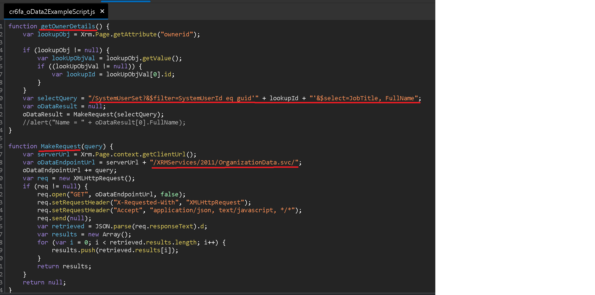

# Detecting OData v2.0 Usage in Dataverse

## Important Revisions

Updated April 12, 2023  -  OData2 service removal is postponed. Will not be removed on April 30, 2023

## Overview

[Dataverse OData v2.0 Service removal](https://learn.microsoft.com/en-us/power-platform/important-changes-coming#dataverse-odata-v20-service-removal) date has been shifting but the most recent decision is not to remove it on April 30, 2023.  The [Product Group post](https://powerapps.microsoft.com/en-us/blog/odata-v2-0-service-removal-date-announcement/) has indicated these requests make up a small portion of the overall API traffic to Dataverse. Although, small in quantity the impact to your origination may be large. I've encountered many customers unknowingly using customizations making requests to Dataverse OData v2.0 endpoint.  I feel it's important to try minimize the possibility of impact on an environment. In this post we'll explorer some methods to find these requests in your environment.

- Topics
  - Importance of Solution Checker and one of its limitations
  - Importance of ensuring both Microsoft and 3rd party solutions are updated
  - Using telemetry from Dataverse Application Insights to assist in finding requests to "xrmservices/2011/organizationdata.svc" endpoint
  - Using Browser Debugging Tools
  - Updating your Code

### Solution Checker

Use the [Solution Checker](https://learn.microsoft.com/en-us/power-apps/maker/data-platform/use-powerapps-checker) to detect any JavaScript web resource code. The rule [web-avoid-crm2011-service-odata](https://learn.microsoft.com/en-us/power-apps/maker/data-platform/powerapps-checker/rules/web/avoid-crm2011-service-odata) should detect usage in client-side code.

#### Limitation

**Solution Checker can only be run on unmanaged solutions**. Since it can't be run on managed solutions that leave a potential area of impact you can't scan. We'll touch on additional detection options later in the article.

### Update Solutions

Both Microsoft, Partners and ISVs will have to update customizations to avoid Dataverse OData v2. It's important you identify and update any solutions obtained from these sources. I cannot stress this point enough as it's often overlooked.

- Update Dynamics 365 apps in the Environment
  - ['Dynamics 365 apps' can be managed](https://learn.microsoft.com/en-us/power-platform/admin/manage-apps#environment-level-view-of-apps) using Power Platform Admin Center. If an update is available there will be an indication in the 'Status' column.
  

- Update Partners and ISVs Solutions
  - I've have found many customer using old ISV solutions when there are updated solutions available. Some are making requests to "xrmservices/2011/organizationdata.svc" when updated solutions are available to mitigate these requests.

### Application Insights

Power Platform has an [excellent feature](https://learn.microsoft.com/en-us/power-platform/admin/analyze-telemetry) where you can set up an Application Insights environment to receive telemetry on diagnostics and performance captured by the Dataverse platform. Although, this post focuses on a specific usage of telemetry it has many other usages. For many detailed Power Platform monitoring topics refer to the [blog post](https://community.dynamics.com/365/b/crminthefield/posts/monitoring-the-power-platform-introduction) of my co-worker. If your're interested in learning more my team has a list of [service offerings](https://community.dynamics.com/365/b/crminthefield/posts/pfe-dynamics-365-service-offerings) a couple offerings focus on monitoring.

This telemetry data can be useful for understanding the number of "/xrmservices/2011/organizationdata.svc" requests, who is making them and potentially how they are being made.

Origins to Consider:

- Most commonly these request originate in JavaScript code within model driven apps
- [Power Query](https://learn.microsoft.com/en-us/powerquery-m/odata-feed) via [Odata Feed Connector](https://learn.microsoft.com/en-us/power-query/connectors/odata-feed)(Excel, Power Bi...)
- PowerShell via [Invoke-WebRequest](https://learn.microsoft.com/en-us/powershell/module/microsoft.powershell.utility/invoke-webrequest?view=powershell-7.3)  then a  can me made from many places.
- Any other programming language or service capable of invoking a request with the Authentication header value of Bearer token.

#### Attributes useful for Identification of the Request Source

##### **user_Id**

The 'user_Id' column is present in all Application Insights tables but for Dataverse telemetry the value does not have a common meaning in all tables.

- 'pageViews' Table
  - 'user_Id' value represents the 'systemuserid' column on the Users(systemuser) table in Dataverse.
    - Example Web API Query to get the Users Name for a given 'systemuserid'```https://MY ORGANIZATION.REGION.dynamics.com/api/data/v9.1/systemusers(ID From Telemetry)?$select=fullname,domainname```

- 'requests', 'dependencies', 'exceptions' Tables
  - 'user_Id' value represents the 'azureactivedirectoryobjectid' column on the Users(systemuser) table in Dataverse.
    - Example Web API Query to get the Users Name given 'azureactivedirectoryobjectid'```https:/MYORGANIZATION.REGION.dynamics.com/api/data/v9.1/systemusers?$select=fullname,domainname&$filter=azureactivedirectoryobjectid eq ID From My Telemetry```

The Web API queries above can be run in the browser for single user_Ids. A list of all Users can be obtained with the following query.
```https:/MYORGANIZATION.REGION.dynamics.com/api/data/v9.1/systemusers?$select=systemuserid,azureactivedirectoryobjectid,fullname,domainname```

Additionally, you can choose to export query results from Application Insights using 'Power BI(as an M Query)'. Using this you could build a report that links Power BI to Dataverse Users(systemuser) Table.

##### **User Agent**

The [User Agent](https://developer.mozilla.org/en-US/docs/Web/HTTP/Headers/User-Agent) can be an indicator of the request origin

- 'requests' table has 'userAgent' in the 'customDimensions' column
- 'dependencies' table has 'userAgent' in the 'customDimensions' column when the 'type' column equal to "UCI REQUEST"
- 'pageViews' table may have 'userAgent' in the 'customDimensions' column for some telemetry

Here are some examples:
**Note: This is not intended to be a comprehensive list. These are some I've tested and observed**. If you find something unknown I suggest using one of the many online tools for parsing User Agents.

- Web Browser
  - User Agents starting with 'Mozilla' indicate a web browser
    - Example - ```'Mozilla/5.0 (Windows NT 10.0; Win64; x64) AppleWebKit/537.36 (KHTML, like Gecko) Chrome/110.0.0.0 Safari/537.36 Edg/110.0.1587.63'```
- Mobile Application
  - Microsoft Dynamics 365 App from an Android Phone ```Mozilla/5.0 (Linux; Android 13; SM-S906U Build/TP1A.220624.014; wv) AppleWebKit/537.36 (KHTML, like Gecko) Version/4.0 Chrome/111.0.5563.116 Mobile Safari/537.36 OAuth MSAuthHost```
  - Microsoft Dynamics 365 App from iPhone ```Mozilla/5.0 (iPhone; CPU iPhone OS 16_3_1) AppleWebKit/605.1.15 (KHTML, like Gecko) B7F62B65BN.com.okta.ios.mobile/6.30.0 OktaMobile/6.30.0 iOS/16.3.1 Apple/iPhone13,2 52496DDF-4D0D-4121-BB95-FCD276C6038A```
- Power Query via Odata Feed Connector(Excel, Power Bi...)
  - User Agents containing 'Microsoft.Data.Mashup' indicates Excel or PowerBI
    - Example ```'Microsoft.Data.Mashup (<https://go.microsoft.com/fwlink/?LinkID=304225>)'```
- PowerShell
  - I've seen the User Agent empty or contain 'PowerShell'
    - Example Invoke-WebRequest from PS on Windows ```Mozilla/5.0 (Windows NT; Windows NT 10.0; en-US) WindowsPowerShell/5.1.22621.963```
- C# Code
  - These request most likely will have an empty User Agent String

##### **name**

'name' column in Dataverse telemetry will have multiple meanings. It depends on the table and telemetry type.

- 'pageViews' name column will most often have a value like 'EditForm Load - opportunity' where it's a concatenation of two columns(pageName - entityName) in the 'customDimensions'. Using this column might be a bit more convenient than parsing the other two values.
- 'requests' name column will have the value of 'Organization Service Request' or 'Web API Request'
  - 'Web API Request' represent the [Microsoft Dataverse Web API](https://learn.microsoft.com/en-us/power-apps/developer/data-platform/webapi/overview). This is the newest and recommended API.
  - 'Organization Service Request' represent the requests to the [Organization Service](https://learn.microsoft.com/en-us/power-apps/developer/data-platform/org-service/overview)
  **For this topic we are only interested in some of requests and they will have the 'name' value of 'Organization Service Request'.**
- 'dependencies' name column has the widest variation. But where the 'type' is equal to "UCI REQUEST" the name is a duplication on the target column. It's the URL of the resource request.

##### **hostType, formId, appModule and entityName**

- 'pageViews' telemetry has ['hostType'](https://learn.microsoft.com/en-us/power-platform/admin/telemetry-events-model-driven-apps#where-is-the-page-load-data-available) in the 'customDimensions' column. This will indicate Browser, MobileApplication or Embedded.
- 'pageViews' telemetry has ['formId'](https://learn.microsoft.com/en-us/power-platform/admin/telemetry-events-model-driven-apps#where-is-the-page-load-data-available) in the 'customDimensions' column. The [formId](https://learn.microsoft.com/en-us/power-apps/developer/data-platform/reference/entities/systemform) uniquely identifies a form and can be used to correlate issues affecting that specific form.
- 'pageViews' telemetry has ['appModule'](https://learn.microsoft.com/en-us/power-platform/admin/telemetry-events-model-driven-apps#where-is-the-page-load-data-available) in the 'customDimensions' column. The 'appModule' identifies the Model Driven app by it's ['uniquename'](https://learn.microsoft.com/en-us/power-apps/developer/data-platform/reference/entities/appmodule#BKMK_UniqueName)
- 'pageViews' telemetry has ['entityName'](https://learn.microsoft.com/en-us/power-platform/admin/telemetry-events-model-driven-apps#where-is-the-page-load-data-available) in the 'customDimensions' column. This attribute is present when relevant. It's available on page types like EditForm, EntityList, and Dashboards when they're bound to an entity. In some scenarios, the form isn't bound to an entity and the value appears as undefined.

##### **session_Id**

Browser interaction with Dataverse Model Driven App has a 'Session ID'. **Model Driven Apps are assigned a 'session_Id' for each web browser tab**. It's helpful to know the 'session_Id' can be observed in the UI of a Model Driven App.

Example of viewing the Session ID in Model Driven App


 This 'session_Id' is logged in telemetry. 'session_Id' itself isn't very useful. But used in combination with 'user_Id' it can be helpful.

##### **operation_Id**

An 'operation_Id' can be used to associate telemetry from a single operation in Application Insights. For example the when opening an Model Driven App Account Form is an operation. This action is assigned an 'operation_Id'. Using [Transaction Search](https://learn.microsoft.com/en-us/azure/azure-monitor/app/diagnostic-search) with an 'operation_Id' quickly shows the association of 'pageViews', 'dependencies', 'requests' and 'exceptions' Tables. 'operation_Id is also the field used when performing a join when querying the Logs.

#### Example Queries

Let's look at some example queries useful for finding "organizationdata.svc" requests in Application Insights Logs


Keeping in mind the section above we'll look at some example queries for reporting requests. "xrmservices/2011/organizationdata.svc" endpoint can be logged in 'dependencies' or 'requests' tables.

- **'dependencies'** [of type 'UCI Requests'](https://learn.microsoft.com/en-us/power-platform/admin/telemetry-events-model-driven-apps#what-kind-of-data-is-available-for-uci-outbound-network-requests) are calls to other dependencies made by Unified Interface to render a certain page. They might be outgoing calls to Dataverse or to other integrations. For the purpose of this topic we **consider any 'OrganizationData.svc' requests logged in 'dependencies' table directly related to client side customizations**.
- **'requests'** are most likely originating outside the Model Driven App(Power BI, Power Shell, Code...). I don't feel confident saying there isn't a scenario where client-side customizations log to 'requests'. For example a "OrganizationData.svc" request from an HTML Web Resource would likely log to 'requests' table. If a request has a session_Id that's not all zeros I'd suspect it's from client-side customizations.

##### **Most basic detection queries**

 A couple basic queries to determine if 'OrganizationData.svc' is being used in your organization.

``` KUSTO
requests 
| where name == "Organization Service Request"
| where url has "OrganizationData.svc"
| summarize count()
```

``` KUSTO
dependencies 
| where target has "OrganizationData.svc"
| summarize count()
```

If these queries return a count above zero, then I suggest moving onto some advanced queries. Examples continue below.

##### **Getting More Details**

You'll notice at the top of each query I've added 'starttime' and 'endtime'. Update these with a UTC value for the span you'd like to evaluate. These are examples but using details I've listed above you can expand on these queries.

###### Finding External Requests

List all "OrganizationData.svc" in 'requests' table with most valuable attributes for identification

``` KUSTO
let starttime = todatetime('2023-04-6T00:00Z');
let endtime =  todatetime('2023-04-10T23:59Z');
requests
| where timestamp between (starttime..endtime)
| where operation_Name has "OrganizationData.svc"
| extend userAgent = tostring(customDimensions.userAgent)
| project timestamp, ['systemuser.azureactivedirectoryobjectid']=user_Id, operation_Name,userAgent,session_Id,operation_Id
```

Add some aggregation with the [summarize operator](https://learn.microsoft.com/en-us/azure/data-explorer/kusto/query/aggregation-functions) to allow for easier consumption.

Below we summarize to get a count of the requests by user_Id,  operation_Name and use the [bin](https://learn.microsoft.com/en-us/azure/data-explorer/kusto/query/binfunction) function to bucket all requests in a 15 minute time period.

``` KUSTO
let starttime = todatetime('2023-04-6T00:00Z');
let endtime =  todatetime('2023-04-10T23:59Z');
requests
| where timestamp between (starttime..endtime)
| where operation_Name has "OrganizationData.svc"
| extend userAgent = tostring(customDimensions.userAgent)
| project timestamp, ['systemuser.azureactivedirectoryobjectid']=user_Id, operation_Name,userAgent,session_Id,operation_Id
| summarize count() by  ['systemuser.azureactivedirectoryobjectid'], operation_Name, bin(timestamp,15m)
```

###### Finding requests from Client-Side code

Joining 'dependencies' with "OrganizationData.svc" and 'pageViews' we can get single view of requests suspected to be originating from client-side customizations. Using a leftouter join is required because not all dependencies can be linked to a type of [types of Page loads](https://learn.microsoft.com/en-us/power-platform/admin/telemetry-events-model-driven-apps#what-kind-of-page-loads-are-available) we log. A good example is that a form onload event occurs on pageViews type of 'EditForm Load' and can be linked directly to a dependencies table. However, an onchange event on a form load doesn't have an entry in pageViews but is still logged in the dependencies table.

``` KUSTO
let starttime = todatetime('2023-04-6T00:00Z');
let endtime =  todatetime('2023-04-10T23:59Z');
dependencies 
| where timestamp between (starttime..endtime)
| where target has "OrganizationData.svc"
| extend userAgent = tostring(customDimensions.userAgent)
| extend appModule = tostring(customDimensions.appModule)       
| project operation_Id,['systemuser.azureactivedirectoryobjectid']=user_Id,target,userAgent,timestamp
| join kind=leftouter  (
    pageViews 
    | where timestamp between (starttime..endtime)
    | extend hostType = tostring(customDimensions.hostType)
    | extend formId = tostring(customDimensions.formId)    
    | extend appModule = tostring(customDimensions.appModule)        
    | project ['systemuser.userid']=user_Id,pageName=name, operation_Id,hostType,formId,appModule,timestamp) on operation_Id
| project timestamp, appModule,hostType, ['systemuser.userid'], ['systemuser.azureactivedirectoryobjectid'],pageName, formId,target, userAgent
```

Add some aggregation with the [summarize operator](https://learn.microsoft.com/en-us/azure/data-explorer/kusto/query/aggregation-functions) to allow for easier consumption.

Below we summarize to get a count of the requests by appModule, userId(both representations), hostType,pageName,formId and target

``` KUSTO
let starttime = todatetime('2023-04-6T00:00Z');
let endtime =  todatetime('2023-04-10T23:59Z');
dependencies 
| where timestamp between (starttime..endtime)
| where target has "OrganizationData.svc"
| extend userAgent = tostring(customDimensions.userAgent)
| extend appModule = tostring(customDimensions.appModule)       
| project operation_Id,['systemuser.azureactivedirectoryobjectid']=user_Id,target,userAgent,timestamp
| join kind=leftouter  (
    pageViews 
    | where timestamp between (starttime..endtime)
    | extend hostType = tostring(customDimensions.hostType)
    | extend formId = tostring(customDimensions.formId)    
    | extend appModule = tostring(customDimensions.appModule)        
    | project ['systemuser.userid']=user_Id,pageName=name, operation_Id,hostType,formId,appModule,timestamp) on operation_Id
| project timestamp, appModule,hostType, ['systemuser.userid'], ['systemuser.azureactivedirectoryobjectid'],pageName, formId,target, userAgent
| summarize count() by appModule, ['systemuser.userid'], ['systemuser.azureactivedirectoryobjectid'],hostType,pageName,formId, target
```

These were just some examples to get started. Here are some thoughts to keep in mind when querying

- When you find something of interest isolate it by adding additional filtering with 'where'
- 'bin' is optional but very useful. Adjusting the time span value in the 'bin' function. This can be very useful to understand if the requests are occurring in frequent succession or spread out evenly.
- Visualization
  - Another very useful thing is to add '[| render timechart](https://learn.microsoft.com/en-us/azure/data-explorer/kusto/query/renderoperator?pivots=azuremonitor)' to get a visualization. There is also a 'Chart' option in query result pane

### Browser Debugging

If know the request originate from the browser but you're not able to decern the origin you may need to investigate deeper. Commonly this is a browser debugging session with a user you've targeted to be making the requests.

Although, the topic of browser debugging is complex and varies slightly by browser I'll provide a basic process.

- [Open Dev Tools](https://learn.microsoft.com/en-us/microsoft-edge/devtools-guide-chromium/overview#open-devtools)
- Open the ['Network' activity inspector tab](https://learn.microsoft.com/en-us/microsoft-edge/devtools-guide-chromium/network)
- The top toolbar contains an option to [filter network requests](https://learn.microsoft.com/en-us/microsoft-edge/devtools-guide-chromium/network/#understand-the-network-tool-user-interface)
- Apply a filter to network requests for the value 'organizationdata.svc'


Browse the suspected parts of the application. Once you see a result in the filtered Network tab.

"Initiator" column will show the cause of the resource request. Hovering over the value will show the full callstack.


Clicking any link in the 'Initiator' column takes you to the source code. The first item 'e.send' in the callstack isn't the point of interest look for script files and methods lower down.


Review the offending code. Often an 'organizationdata.svc' request involves multiple functions across multiple JavaScript files. This is because it's very common for the JavaScript to use a common library to make a request to 'organizationdata.svc'.

The example below shows the two functions involved and they are in a single file. In this instance the JavaScript webresource ```cr6fa_oData2ExampleScript.js``` function ```getOwnerDetails``` passes a OData2 query to ```MakeRequest``` function which performs the request.


### Updating your Code

Suggestions can be found in [this documentation](https://learn.microsoft.com/en-us/power-apps/developer/model-driven-apps/best-practices/business-logic/do-not-use-odata-v2-endpoint?tabs=odatav2).

When updating JavaScript the recommended approach is to use Xrm.WebApi. Xrm.WebApi is async and has the potential to improve the end-user experience. The [Xrm.WebApi Documents](https://learn.microsoft.com/en-us/power-apps/developer/model-driven-apps/clientapi/reference/xrm-webapi) have many examples. I do recommend heading over to check out my [colleague’s blog post Async Await patterns]( https://community.dynamics.com/365/b/crminthefield/posts/get-a-value-from-dynamics-365-ce-api-with-async-await-484252633).

There are multiple patterns for executing async JavaScript and I'm showing one sample of refactoring code below.

#### **Old ODATA2 Code**

``` javascript
"use strict";
function getOwnerDetails(executionContext ) {
    var formContext = executionContext.getFormContext();
    var lookupObj = formContext.getAttribute("ownerid");

    if (lookupObj != null) {
        var lookUpObjVal = lookupObj.getValue();
        if ((lookUpObjVal != null)) {
            var lookupId = lookUpObjVal[0].id;
        }
    }
    var selectQuery = "?&$filter=SystemUserId eq guid'" + lookupId + "'&$select=JobTitle, FullName";
    var oDataResult = null;
    oDataResult = MakeRequest("SystemUserSet",selectQuery);
    var nameAndTitle = null;
    if(oDataResult!==null)
    {
        nameAndTitle = oDataResult[0].FullName + " - "+ oDataResult[0].JobTitle;
    }  

    return nameAndTitle;
}

"use strict";
function MakeRequest(table, query) {
    var globalContext = Xrm.Utility.getGlobalContext();
    var serverUrl = globalContext.getClientUrl();
    var oDataEndpointUrl = serverUrl + "/XRMServices/2011/OrganizationData.svc/"+ table;
    oDataEndpointUrl += query;
    var req = new XMLHttpRequest();
    if (req != null) {
        req.open("GET", oDataEndpointUrl, false);
        req.setRequestHeader("X-Requested-With", "XMLHttpRequest");
        req.setRequestHeader("Accept", "application/json, text/javascript, */*");
        req.send(null);
        var retrieved = JSON.parse(req.responseText).d;
        var results = new Array();
        for (var i = 0; i < retrieved.results.length; i++) {
            results.push(retrieved.results[i]);
        }
        return results;
    }
    return null;
}
```

#### **Code Updated to use WebApi**

``` javascript
"use strict";
function getOwnerDetails(executionContext ) {
    var formContext = executionContext.getFormContext();
    var lookupObj = formContext.getAttribute("ownerid");

    if (lookupObj != null) {
        var lookUpObjVal = lookupObj.getValue();
        if ((lookUpObjVal != null)) {
            var lookupId = lookUpObjVal[0].id;
        }
    }
    var query = "?$select=jobtitle, fullname";    
    Xrm.WebApi.retrieveRecord("systemuser", lookupId, query).then(
        function success(result) {
            var nameAndTitle = null;
            if(result!==null)
            {
                try
                {
                    nameAndTitle = result.fullname + " - "+ result.jobtitle;
                }
                catch(error)
                {
                    // handle error conditions
                    var alertStrings = { confirmButtonLabel: "Yes", text: "Error Returning Results " + error};
                    var alertOptions = { height: 120, width: 260 }; 
                    Xrm.Navigation.openAlertDialog(alertStrings, alertOptions);
                }
            }              
            return nameAndTitle;
        },
        function (error) {
            // handle error conditions
            var alertStrings = { confirmButtonLabel: "Yes", text: "Error Retrieving Record " + error};
            var alertOptions = { height: 120, width: 260 }; 
            Xrm.Navigation.openAlertDialog(alertStrings, alertOptions);
        }
    );    
}
```
